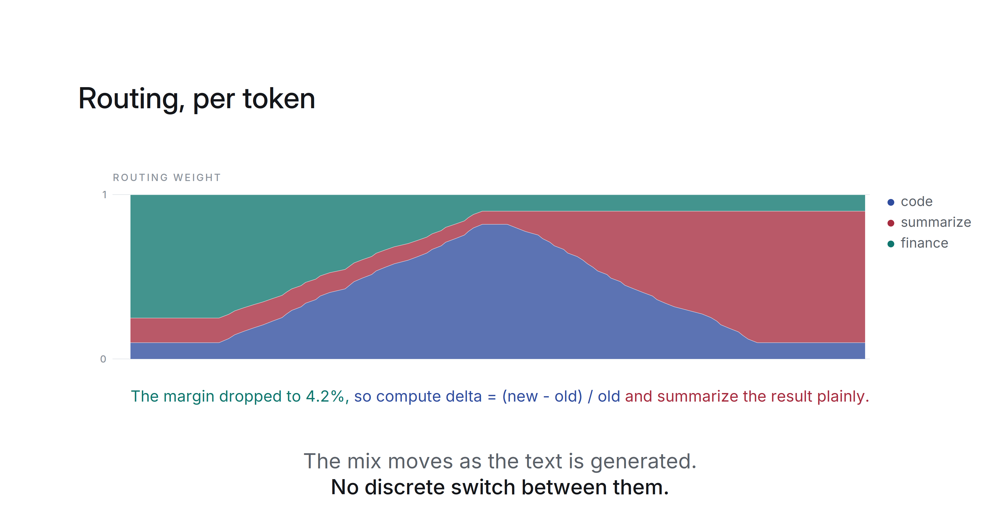

# LARA

Lightweight Additive Residual Adaptation: residual-stream adapters for frozen LLMs. Matches LoRA at equal parameters, runs many behaviors per token.

<div align="left">    
    
[](https://doi.org/10.48550/arXiv.2607.28669)
[](https://colab.research.google.com/github/pfekin/LARA/blob/main/examples/quickstart.ipynb)
[](https://www.python.org/downloads/)
[](https://pytorch.org/)
[](https://huggingface.co/)
[](LICENSE)
</div>

<picture>
  <source media="(prefers-color-scheme: dark)" srcset="media/LARA_readme_hero_dark.png">
  
</picture>

[Slides](media/LARA_slides.pdf) · [Video walkthrough](https://github.com/user-attachments/assets/b2d1e8b0-c25d-40fe-af77-64a3f2c6ae47) - the idea in eleven slides.


LARA adapts a language model without writing to its weights. At a small set of layers it reads the hidden state, computes a low-rank correction, and adds it back to the residual stream. The base model is loaded once and stays frozen, so each adapted behavior is a separate file of a few megabytes, and several of them can sit on one model at the same time.

At equal parameter counts, LARA matches LoRA on a code fine-tuning task and on preference optimization. What it adds is a scale you can turn at inference, and the ability to hold many behaviors resident on one base and pick between them per token.

## How it works

At each of its layers, a module does this:

```python
h = h + gamma * (alpha / rank) * up(down(layer_norm(h)))
```

`down` projects to rank `r`, `up` projects back. `up` starts at zero, so an untrained module contributes nothing and the model is exactly the base. Nothing else is touched: with the modules removed the forward pass is identical, bit for bit.

At rank 128 over six layers of a 1.5B model that is about 2.4M trainable parameters, or 33 MB for seven behaviors.

Because no weights are modified, behaviors compose. A small router reads the frozen hidden state and produces a per-token distribution over the behaviors in the bank, and their corrections are blended by weight.

## Install

```bash
pip install git+https://github.com/pfekin/LARA.git
```

Or from a clone:

```bash
git clone https://github.com/pfekin/LARA.git
cd LARA
pip install -e .
```

Python 3.9 or later, torch 2.0 or later. The examples also need `transformers`, `datasets`, `accelerate` and `trl`:

```bash
pip install -e ".[examples]"
```

## Train a behavior

```python
from transformers import AutoModelForCausalLM, Trainer, TrainingArguments
from lara import LARA

model = AutoModelForCausalLM.from_pretrained("Qwen/Qwen2.5-1.5B-Instruct")

lara = LARA(model, layers=6, rank=128)     # base frozen, 2.4M trainable
print(lara.num_trainable())

trainer = Trainer(model=model, args=TrainingArguments(...), train_dataset=ds)
trainer.train()

lara.save("behaviors/code", route_samples=prompts[:200])
```

`layers=6` spreads six modules evenly over the depth. On a 28-layer model that resolves to `[4, 8, 12, 16, 20, 24]`. Pass a list instead for exact control.

LARA does not replace or wrap the trainer. It attaches the modules to the model and freezes everything else, so `model.parameters()` reaches the modules and any trainer picks them up: the HF `Trainer`, TRL's `DPOTrainer` or `GRPOTrainer`, or a loop you wrote yourself. The objective makes no difference to the artifact. A behavior trained with DPO loads and routes exactly like one trained with cross-entropy.

Fine-tuning benefits from several layers. Preference optimization reaches the same quality with one module in the middle of the network, so `layers=1` is often enough there.

## Turn the adaptation up or down

The correction is additive over an unchanged base, so its strength is a runtime value rather than something fixed at training time:

```python
lara.gamma = 0.0     # the frozen base
lara.gamma = 0.5     # halfway
lara.gamma = 1.0     # the trained behavior
```

Useful range is roughly 0 to 1.5. Past that the correction is amplified beyond what it was trained for and quality falls away.

## Run many behaviors on one model

```python
from lara import Bank

bank = Bank(model, tokenizer)
bank.add("code",   "behaviors/code")      # trained with cross-entropy
bank.add("math",   "behaviors/math")
bank.add("polite", "behaviors/polite")    # trained with DPO
bank.fit_router()

out = model.generate(**inputs)            # routing happens inside the forward pass
```

`fit_router` trains a linear classifier, about 11k parameters, on the route samples stored inside each behavior. It takes seconds.

Adding one later does not disturb the others:

```python
bank.add("legal", "behaviors/legal")
bank.fit_router(mode="append")            # keeps the existing rows, fits the new one
```

Save and reload the whole bank:

```python
bank.save("mybank/")
bank = Bank.load("mybank/", model, tokenizer)
```

## Routing

`top_k` controls how many behaviors are applied to each token:

```python
bank.top_k = None    # blend all of them by weight (default)
bank.top_k = 2       # blend the two highest, ignore the rest
bank.top_k = 1       # hard selection, one behavior per token
```
<picture>
  <source media="(prefers-color-scheme: dark)" srcset="media/LARA_readme_routing_dark.png">
  
</picture>

Behaviors with no weight are skipped, so cost tracks `top_k` rather than the size of the bank. Blending is worth having when behaviors overlap, since a token the router is unsure about gets a mixture rather than a single wrong choice.

Weight-space adapters do not blend as readily. A LoRA update costs nothing at inference once it is merged into the weight matrix, but merging commits the model to one adapter, the same for every token. Mixing several per token means leaving them all unmerged and computing each one's contribution at every matrix it targets, so the work grows with the number of adapters times the number of target matrices. A LARA behavior contributes one vector per layer it sits on, whatever the base does at that layer, so mixing is a weighted sum of vectors.

To override the router:

```python
with bank.pin("code"):                        # one behavior, router ignored
    out = model.generate(**inputs)

with bank.pin({"code": 1.0, "polite": 0.4}):  # a blend you chose
    out = model.generate(**inputs)

with bank.disabled():                         # the frozen base
    out = model.generate(**inputs)
```

Per-behavior scales work too:

```python
bank.set_gamma("polite", 0.6)
```

To see what the router is doing:

```python
bank.route_weights(input_ids)
# {'code': 0.71, 'math': 0.04, 'polite': 0.25}
```

## What a behavior looks like on disk

```
behaviors/code/
  adapter.safetensors     the projections, a few MB
  config.json             layers, rank, alpha, base model id
  route_samples.jsonl     short texts typical of this behavior
```

The route samples are what let a behavior be routed by someone who does not have the data it was trained on. Without them, `fit_router` has nothing to separate.

A behavior records the base it was trained against and refuses to load onto a different one, rather than loading and producing noise.

## API

`LARA(model, layers=6, rank=128, alpha=128)` attaches modules to a frozen model. `layers` is a count or a list.

- `lara.gamma` scale applied at inference
- `lara.num_trainable()` parameter count
- `lara.save(path, route_samples=..., method=...)` write the behavior
- `LARA.from_pretrained(model, path)` attach a saved behavior
- `lara.disabled()` context manager that runs the frozen base
- `lara.detach()` remove the modules and hooks

`Bank(model, tokenizer, top_k=None)` holds several behaviors over one frozen model.

- `bank.add(name, path)` add a behavior
- `bank.remove(name)` drop one
- `bank.fit_router(mode="refit"|"append", steps=300)` train the router
- `bank.top_k` how many behaviors apply per token
- `bank.pin(name_or_dict)` context manager that overrides the router
- `bank.disabled()` context manager that runs the frozen base
- `bank.gamma`, `bank.set_gamma(name, g)` scales
- `bank.route_weights(input_ids)` mean routing weight per behavior
- `bank.save(path)`, `Bank.load(path, model, tokenizer)`

## Examples

Runnable end to end on one GPU:

- `examples/01_finetune.py` trains a behavior with the HF `Trainer`
- `examples/02_dpo.py` aligns one with TRL's `DPOTrainer`, producing the same kind of artifact
- `examples/03_bank.py` loads both onto one model, fits a router, and generates under soft routing, hard routing and pinning

Run 01 and 02 first, since 03 uses what they write.

## Tests

```bash
python tests/test_lara.py
```

Covers layer resolution, the no-op at initialization, freezing, save and load, routing, `top_k`, pinning, and incremental addition. No model download, so it runs anywhere.

## Paper and experiments

The benchmark [code](https://github.com/pfekin/LARA/tree/main/research) that produced the numbers in the [preprint](https://doi.org/10.48550/arXiv.2607.28669), with the [configuration and instructions](research.md) to rerun it.

## Citation

```bibtex
@article{ekin2026laralightweightadaptersresidual,
      title={LARA: Lightweight Adapters in the Residual Stream for Composable Adaptation and Alignment}, 
      author={Pascal Ekin and Hyosun Choi and Wei Jie},
      year={2026},
      eprint={2607.28669},
      archivePrefix={arXiv},
      primaryClass={cs.LG},
      url={https://arxiv.org/abs/2607.28669}, 
}
@software{ekin2026lara,
  title   = {Lightweight Additive Residual Adaptation (LARA): residual-stream adapters for frozen LLMs. Runs many behaviors per token.},
  author  = {Pascal Ekin},
  year    = {2026},
  url     = {https://github.com/pfekin/LARA}
}
```
