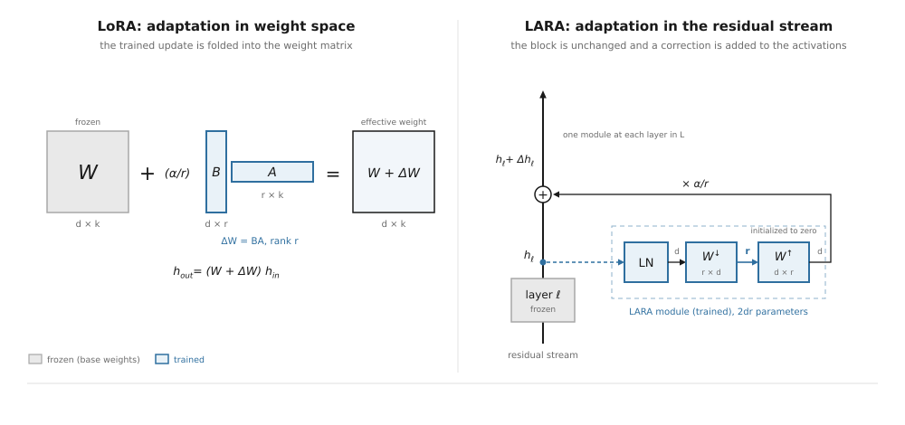

# LARA

**Lightweight Additive Residual Adaptation**: post-training for frozen language models, with small adaptations that can be combined as a **Mixture of Behaviors (MoBs)**.

[](https://www.python.org/downloads/)
[](https://pytorch.org/)
[](https://huggingface.co/)

<picture>
  <source media="(prefers-color-scheme: dark)" srcset="media/LARA_readme_hero_dark.png">
  
</picture>

[Paper](https://doi.org/10.48550/arXiv.2607.28669) · [Slides](media/LARA_slides.pdf) · [Video walkthrough](https://github.com/user-attachments/assets/9591acc0-d7f4-4c71-895a-26798a0b03e5)

Foundation models made it practical to train a general model first and tailor it afterwards. LARA is a post-training method for that second step. It adapts a frozen language model without changing its weights, producing a small behavior artifact that remains separate from the base model.

The broader idea is **Mixture of Behaviors (MoBs)**: a collection of independently trained behaviors sharing one frozen base. Behaviors can be trained with supervised fine-tuning, preference optimization such as DPO, or reinforcement learning such as GRPO. They can then be selected, scaled, pinned, or composed at inference time, with hard or soft routing.

```text
capability        = base model
behavior          = learned adaptation
selection         = router
strength          = runtime scaling
combination       = composition
```

This treats post-training as a modular layer around a foundation model.



*LoRA adapts in weight space. LARA adapts in the residual stream. The base block stays frozen while a low-rank correction is read from the stream and added back.*

## Why LARA

LoRA showed that useful adaptation does not require updating every parameter of a language model. LARA follows the same general motivation but puts the correction in the residual stream rather than in the model's weight matrices.

The base model is loaded once and stays frozen. Each behavior is a thin module over that shared base, typically only a few megabytes. This matters when several adaptations are needed: another behavior does not require another copy of the base model.

At rank 128 over six layers of a 1.5B model, one behavior has about 2.4M trainable parameters. Seven behaviors occupy about 33 MB of adapter storage, compared with roughly 21 GB for seven separate 3 GB models.

## How it works

At each selected layer, LARA applies a low-rank correction to the residual stream:

```python
h = h + gamma * (alpha / rank) * up(down(layer_norm(h)))
```

The base weights remain frozen. The `up` projection starts at zero, so an untrained behavior is a no-op and the model initially behaves exactly like the base.

The correction has a runtime scale:

```text
gamma = 0       frozen base
gamma = 0.5     partial behavior
gamma = 1.0     trained behavior
```

The same behavior can therefore be applied with different strengths at inference time.

## Mixture of Behaviors

A **behavior** is one learned adaptation. A **MoB** is the bank of behaviors together with the runtime mechanism that selects or combines them.

<picture>
  <source media="(prefers-color-scheme: dark)" srcset="media/figure2_mobs_dark.svg">
  
</picture>

For example:

```text
one base model

    + code behavior
    + math behavior
    + medical behavior
    + summary behavior
    + writing-style behavior
    + tutor behavior
```

The behaviors can come from different post-training objectives and still share the same base.

### Routing

Soft routing can blend several behaviors. Hard routing selects one behavior per token. Pinning lets an application explicitly choose a behavior or mixture instead of using the router.

```text
soft:
code       0.60
math       0.10
polite     0.30

hard:
code       1.00

pinned:
code       1.00
polite     0.40
```

<picture>
  <source media="(prefers-color-scheme: dark)" srcset="media/figure3_per_token_routing_dark.gif">
  
</picture>

`top_k` controls how many behaviors can contribute:

```python
bank.top_k = None    # blend all of them by weight
bank.top_k = 2       # blend the two highest
bank.top_k = 1       # hard selection
```

Behaviors can also be pinned or disabled:

```python
with bank.pin("code"):
    out = model.generate(**inputs)

with bank.pin({"code": 1.0, "polite": 0.4}):
    out = model.generate(**inputs)

with bank.disabled():
    out = model.generate(**inputs)
```

A per-behavior scale can be changed independently:

```python
bank.set_gamma("polite", 0.6)
```

## Why this matters for local AI

A small model running on a phone or PC has tighter memory and context constraints than a frontier model in the cloud. Long system prompts, extended conversation histories, and large RAG contexts can therefore become an awkward way to carry every application-specific instruction into every generation.

RAG remains useful when a system needs external or current information. LARA addresses a different problem: learned behavior. A behavior can be encoded once in a small residual-stream module rather than reconstructed from a long prompt each time.

This matters for customization and personalization. A local model can carry a domain behavior, a teaching method, a company's house style, or a user's preferred writing style without requiring all of that behavior to occupy the context window on every request.

## Small model, specialized behavior

A small base model can also become more useful through domain adaptation. In an informal test, a **Qwen3-1.7B** model was asked:

> Name a common over-the-counter pain reliever that reduces fever but does NOT increase bleeding risk.

The question distinguishes acetaminophen and ibuprofen. Both are common pain relievers that reduce fever, but ibuprofen is an NSAID with a bleeding warning; the intended answer was **acetaminophen (Tylenol)**.

With all behaviors disabled, the 1.7B model answered:

```text
A common over-the-counter (OTC) pain reliever that reduces and does
not significantly increase bleeding risk is ibuprofen.
```

With the medical behavior enabled, the same model answered:

```text
Acetaminophen (Tylenol) is a common over-the-counter pain reliever that
reduces fever but does NOT increase bleeding risk.
```

In this test, the adapted 1.7B model gave the same answer as a larger comparison model. This is an illustration, not evidence that LARA makes a 1.7B model generally equivalent to a larger one. It shows that a small domain behavior can change the answer selected by the base model on a domain-specific distinction.

## Modular cognition

The MoB architecture separates the model's shared capability from learned modes of operation:

```text
                 base capability
                       │
        ┌──────────────┼──────────────┐
        ▼              ▼              ▼
      planner        critic        verifier
        │              │              │
        └──────────────┼──────────────┘
                       ▼
                    response
```

This can be used for coding assistants, education, personal AI, enterprise systems, domain specialization, or other applications that need several modes over one base model.

The comparison with mixture-of-experts is useful but limited. MoE routes among experts that are part of one model. MoBs route among lightweight adaptations over one shared base, with the aim of making post-training modular.

## Applications

The same architecture can support an offline AI tutor, a coding assistant with separate coding/debugging/testing behaviors, an enterprise model with department-specific behaviors, or a personal assistant with user-specific adaptations.

A behavior can be distributed or updated independently of the base model. That creates the possibility of treating behaviors as software components: install them, remove them, update them, scale them, compose them, or route between them.

## Usage

Train a behavior:

```python
from transformers import AutoModelForCausalLM, Trainer, TrainingArguments
from lara import LARA

model = AutoModelForCausalLM.from_pretrained("Qwen/Qwen2.5-1.5B-Instruct")

lara = LARA(model, layers=6, rank=128)
trainer = Trainer(model=model, args=TrainingArguments(...), train_dataset=ds)
trainer.train()
lara.save("behaviors/code", route_samples=prompts[:200])
```

Load several behaviors:

```python
from lara import Bank

bank = Bank(model, tokenizer)
bank.add("code", "behaviors/code")
bank.add("math", "behaviors/math")
bank.add("polite", "behaviors/polite")
bank.fit_router()

out = model.generate(**inputs)
```

## Repository

`lara.py` trains a single behavior with LARA or LoRA and compares them at matched parameters for fine-tuning (`task="ft"`) or preference optimization (`task="dpo"`). It also sweeps the inference scale `gamma`.

`routed.py` places several behaviors on one frozen base and routes among them per token, hard or soft. It reports recovery, routing weights, and the co-application readout.

Python 3.10+ and a CUDA GPU are required for the experiments. The experiments run on a single T4 in 8-bit.

```bash
pip install torch transformers peft datasets bitsandbytes accelerate
```

Run the scripts after editing the configuration dictionaries at the top of each file:

```bash
python lara.py
python routed.py
```

Self-tests:

```bash
python lara.py selftest
python routed.py selftest
```

See [research.md](research.md) for the exact experiment settings and reproduction details.

## Citation

```bibtex
@article{ekin2026laralightweightadaptersresidual,
      title={LARA: Lightweight Adapters in the Residual Stream for Composable Adaptation and Alignment},
      author={Pascal Ekin and Hyosun Choi and Wei Jie},
      year={2026},
      eprint={2607.28669},
      archivePrefix={arXiv},
      primaryClass={cs.LG},
      url={https://arxiv.org/abs/2607.28669},
}
@software{ekin2026lara,
  title   = {Lightweight Additive Residual Adaptation (LARA): residual-stream adapters for frozen LLMs. Runs many behaviors per token.},
  author  = {Pascal Ekin},
  year    = {2026},
  url     = {https://github.com/pfekin/LARA}
}
```

## License

[](LICENSE)
