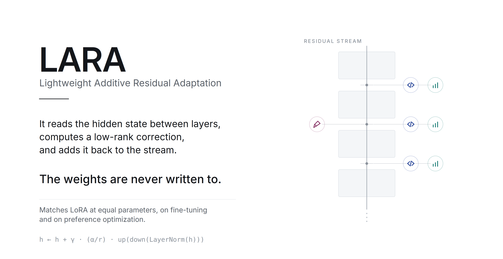
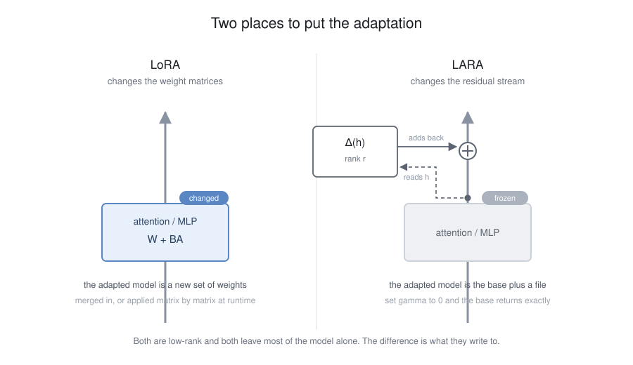
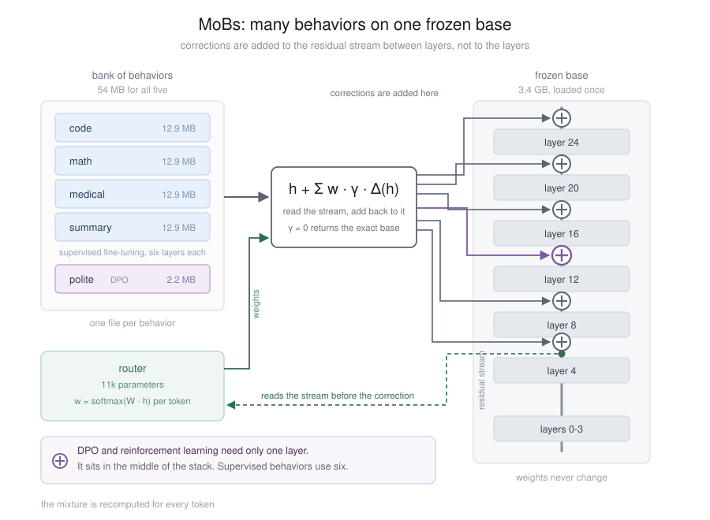
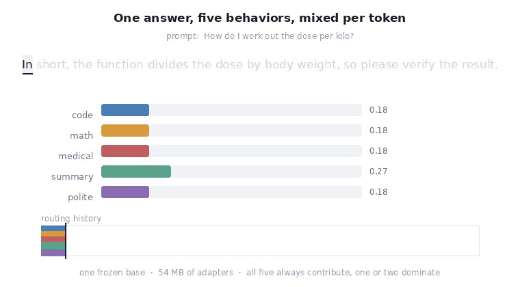

# LARA

**Lightweight Additive Residual Adaptation**: post-training for frozen language models, with small adaptations that can be combined as a **Mixture of Behaviors (MoBs)**.

<!-- Standard Metadata Badges -->
<div align="left">

[](https://doi.org/10.48550/arXiv.2607.28669)
[](https://www.python.org/downloads/)
[](https://pytorch.org/)
[](https://huggingface.co/)
[](LICENSE)

</div>

<!-- Interactive Demos - borderless table -->
<br>

**🎮 Try LARA in your browser – no setup, no account required.**

<table border="0" cellpadding="0" cellspacing="0" style="border: none; border-collapse: collapse; width: 100%;">
  <tr>
    <td style="border: none; padding-right: 30px; vertical-align: top; width: 50%;">
      <a href="https://colab.research.google.com/github/pfekin/LARA/blob/main/mobs/mobs_playground.ipynb">
        
      </a>
      <br>
      <strong>🎛️ Multi-Behavior Playground</strong><br>
      Adjust live sliders and watch the model's output change in real time.
    </td>
    <td style="border: none; padding-left: 30px; vertical-align: top; width: 50%;">
      <a href="https://colab.research.google.com/github/pfekin/LARA/blob/main/hemingway/hemingway_style.ipynb">
        
      </a>
      <br>
      <strong>✍️ Hemingway Style Mimicry</strong><br>
      Train a model to write in famous literary styles, then push it until it becomes a self-parody.
    </td>
  </tr>
</table>

---

<picture>
  <source media="(prefers-color-scheme: dark)" srcset="media/LARA_readme_hero_dark.png">
  
</picture>

[Paper](https://doi.org/10.48550/arXiv.2607.28669) · [Slides](media/LARA_slides.pdf) · [Video walkthrough](https://github.com/user-attachments/assets/9591acc0-d7f4-4c71-895a-26798a0b03e5)

---

## Contents

- [What is LARA?](#what-is-lara)
- [Why LARA?](#why-lara)
- [How it works](#how-it-works)
- [Install](#install)
- [Train a behavior](#train-a-behavior)
- [Turn the adaptation up or down](#turn-the-adaptation-up-or-down)
- [Mixture of Behaviors (MoBs)](#mixture-of-behaviors-mobs)
- [Routing](#routing)
- [Small model, specialized behavior](#small-model-specialized-behavior)
- [What a behavior looks like on disk](#what-a-behavior-looks-like-on-disk)
- [API](#api)
- [Examples](#examples)
- [Tests](#tests)
- [Notebooks](#notebooks)
- [Results](#results)
- [Deep dive](#deep-dive)
- [Citation](#citation)
- [License](#license)

---

## What is LARA?

LARA adapts a frozen language model without modifying its weights, producing a small **behavior** artifact (a few MB) that sits on top of the base model. Multiple behaviors can be loaded simultaneously, mixed, scaled, and routed per token.

```text
capability        = base model
behavior          = learned adaptation
selection         = router
strength          = runtime scaling
combination       = composition
```

<details>
<summary><strong>📖 The bigger picture</strong></summary>

Foundation models made a different approach to AI development possible: build a general model first, then tailor it for particular purposes afterwards. LARA is a post-training method for that second step.

What it adds over a weight-space adapter is a scale you can turn at inference, and the ability to hold many behaviors resident on one base and pick between them per token.

The larger system built around LARA is **Mixture of Behaviors (MoBs)**. A MoB is a collection of independently trained behaviors sharing one frozen base. Behaviors can be trained with SFT, DPO, GRPO or other post-training methods. At inference they can be selected, scaled, pinned or composed, with hard or soft routing.

This turns post-training into a modular layer around a foundation model.
</details>

---

## Why LARA?

LoRA showed that useful adaptation does not require updating every parameter. LARA places the correction in the residual stream rather than in the weight matrices, making behaviors **independent, composable, and runtime-selectable**.

<picture>
  <source media="(prefers-color-scheme: dark)" srcset="media/figure1_lara_vs_lora_dark.svg">
  
</picture>

| | LoRA | LARA |
| :--- | :--- | :--- |
| **Where it acts** | Weight matrices | Residual stream |
| **Can blend multiple adapters per token?** | No (must merge weights) | Yes (weighted sum) |
| **Adapter size (SFT)** | ~2.2M parameters | ~2.4M parameters |
| **Adapter size (DPO/GRPO, 1 LARA layer)** | ~2.2M parameters | **~0.4M parameters** |
| **Runtime scaling** | Fixed at merge time | Adjustable via `gamma` |

*Note: Qwen3-1.7B has 28 total layers. LARA inserts adapters at a subset of them (e.g., 6 evenly spaced for SFT, or a single middle layer for DPO/GRPO).*

---

## How it works

```python
h = h + gamma * (alpha / rank) * up(down(layer_norm(h)))
```

`down` projects to rank `r`, `up` projects back. `up` starts at zero, so an untrained adapter contributes nothing. At rank 128 over six layers of a 1.5B model: ~2.4M trainable parameters, a few MB on disk.

<details>
<summary><strong>⚙️ Technical details</strong></summary>

The base model is loaded once and stays frozen. Each behavior is a separate file, typically a few megabytes. That makes it practical to keep several behaviors on the same model rather than producing a full model for every specialization.

Because no weights are modified, behaviors compose. A small router reads the frozen hidden state and produces a per-token distribution over the behaviors in the bank, and their corrections are blended by weight. There is no limit to how many you install.
</details>

---

## Install

```bash
pip install git+https://github.com/pfekin/LARA.git
```

Or from a clone:

```bash
git clone https://github.com/pfekin/LARA.git
cd LARA
pip install -e .
```

Python 3.9+, torch 2.0+. Examples also need `transformers`, `datasets`, `accelerate` and `trl`:

```bash
pip install -e ".[examples]"
```

---

## Train a behavior

```python
from transformers import AutoModelForCausalLM, Trainer, TrainingArguments
from lara import LARA

model = AutoModelForCausalLM.from_pretrained("Qwen/Qwen2.5-1.5B-Instruct")

lara = LARA(model, layers=6, rank=128)     # base frozen, 2.4M trainable
print(lara.num_trainable())

trainer = Trainer(model=model, args=TrainingArguments(...), train_dataset=ds)
trainer.train()

lara.save("behaviors/code", route_samples=prompts[:200])
```

`layers=6` spreads six adapters evenly over the depth. Pass a list for exact control. LARA works with HF `Trainer`, TRL's `DPOTrainer`, `GRPOTrainer`, or custom loops.

---

## Turn the adaptation up or down

```python
lara.gamma = 0.0     # the frozen base
lara.gamma = 0.5     # halfway
lara.gamma = 1.0     # the trained behavior
```

Useful range: ~0 to 1.5.

---

## Mixture of Behaviors (MoBs)

A **MoB** is a bank of behaviors sharing one frozen base, with a router that selects or combines them per token.

```python
from lara import Bank

bank = Bank(model, tokenizer)
bank.add("code",   "behaviors/code")
bank.add("math",   "behaviors/math")
bank.add("polite", "behaviors/polite")
bank.fit_router()

out = model.generate(**inputs)            # routing happens inside the forward pass
```

<picture>
  <source media="(prefers-color-scheme: dark)" srcset="media/figure2_mobs_dark.svg">
  
</picture>

<sub>Five behaviors on Qwen3-1.7B. Sizes vary with rank and layer count.</sub>

Add behaviors incrementally:

```python
bank.add("legal", "behaviors/legal")
bank.fit_router(mode="append")            # keeps existing rows, fits the new one
```

Save and reload:

```python
bank.save("mybank/")
bank = Bank.load("mybank/", model, tokenizer)
```

---

## Routing

```python
bank.top_k = None    # blend all of them by weight (default)
bank.top_k = 2       # blend the two highest
bank.top_k = 1       # hard selection, one behavior per token
```

<picture>
  <source media="(prefers-color-scheme: dark)" srcset="media/figure3_per_token_routing_dark.gif">
  
</picture>

Override the router:

```python
with bank.pin("code"):                        # one behavior
    out = model.generate(**inputs)

with bank.pin({"code": 1.0, "polite": 0.4}):  # custom blend
    out = model.generate(**inputs)

with bank.disabled():                         # frozen base
    out = model.generate(**inputs)
```

Per-behavior scales:

```python
bank.set_gamma("polite", 0.6)
```

Inspect routing:

```python
bank.route_weights(input_ids)
# {'code': 0.71, 'math': 0.04, 'polite': 0.25}
```

---

## Small model, specialized behavior

**Prompt**: *Name a common over-the-counter pain reliever that reduces fever but does NOT increase bleeding risk.*

| | Without medical behavior | With medical behavior |
| :--- | :--- | :--- |
| **Qwen3‑1.7B output** | *"... ibuprofen."* | *"Acetaminophen (Tylenol) ..."* |
| **Correct?** | ❌ | ✅ |

A lightweight learned behavior corrects a domain-specific distinction without changing the base model. Measurements across five behaviors and four base models are in [research.md](research.md).

---

## What a behavior looks like on disk

```text
behaviors/code/
  adapter.safetensors     # the projections, a few MB
  config.json             # layers, rank, alpha, base model id
  route_samples.jsonl     # short texts for routing
```

---

## API

### `LARA(model, layers=6, rank=128, alpha=128)`

| Method | Description |
| :--- | :--- |
| `lara.gamma` | Scale applied at inference |
| `lara.num_trainable()` | Parameter count |
| `lara.save(path, route_samples=..., method=...)` | Write the behavior |
| `LARA.from_pretrained(model, path)` | Load a saved behavior |
| `lara.disabled()` | Context manager: frozen base |
| `lara.detach()` | Remove adapters and hooks |

### `Bank(model, tokenizer, top_k=None)`

| Method | Description |
| :--- | :--- |
| `bank.add(name, path)` | Add a behavior |
| `bank.remove(name)` | Drop one |
| `bank.fit_router(mode="refit" \| "append", steps=300)` | Train the router |
| `bank.top_k` | How many behaviors apply per token |
| `bank.pin(name_or_dict)` | Context manager: override router |
| `bank.disabled()` | Context manager: frozen base |
| `bank.gamma`, `bank.set_gamma(name, g)` | Per-behavior scales |
| `bank.route_weights(input_ids)` | Mean routing weight per behavior |
| `bank.save(path)`, `Bank.load(path, model, tokenizer)` | Save/load the bank |

---

## Examples

Runnable end to end on one GPU:

- `examples/01_finetune.py` — HF `Trainer`
- `examples/02_dpo.py` — TRL's `DPOTrainer`
- `examples/03_bank.py` — loads both, fits router, generates under routing

[](https://colab.research.google.com/github/pfekin/LARA/blob/main/examples/quickstart.ipynb)

---

## Tests

```bash
python tests/test_lara.py
```

Runs without downloading a model.

---

## Notebooks

Both notebooks run in Google Colab with no setup. They load pre-trained behaviors from the Hugging Face Hub — no account or token required.

---

## Results

For SFT, LARA matches LoRA at equal parameter counts. For DPO and GRPO, a single adapter in the middle of the network is enough — a much smaller artifact than a comparable LoRA. Behaviors transfer across base models and across quantization, down to binary weights.

Full benchmarks, gamma sweeps, and routing tables are in [research.md](research.md), alongside the [benchmark code](https://github.com/pfekin/LARA/tree/main/research) and instructions to rerun it.

---

## Deep dive

<details>
<summary><strong>🧠 Why MoBs matter</strong></summary>

With conventional fine-tuning, specialization tends to produce another model:

```text
base model
   │
   ├── fine-tune → model A
   ├── fine-tune → model B
   └── fine-tune → model C
```

With LARA and MoBs the base capability is shared and the learned behaviors stay independent. This becomes more useful as the number of adaptations grows: a bank of behaviors occupies megabytes of adapter storage rather than one multi-gigabyte model per specialization.

Behaviors also need not be mutually exclusive. A system can combine them at inference: a mathematical behavior together with a tutoring behavior and a preferred writing style, without training a full model for that combination.
</details>

<details>
<summary><strong>🧩 Modular cognition</strong></summary>

The MoB architecture can be read as a form of modular cognition. Different learned behaviors encode different ways of using the same underlying model:

```text
base capability
      │
      ├── planner
      ├── verifier
      ├── critic
      ├── domain specialist
      ├── tutor
      └── personal style
```

A router can select among them or combine them.

The analogy with mixture-of-experts is useful, but the target is different. A conventional MoE routes among experts that are part of one model, mainly to increase capacity. MoBs route among lightweight adaptations over a shared base, to make post-training modular. That difference makes behaviors closer to software components than to further copies of a model.
</details>

<details>
<summary><strong>📱 Why this matters for small local models</strong></summary>

Local AI changes the constraints around customization. A small model running on a phone or PC has less room for long system prompts, extended histories and large RAG contexts than a frontier model in the cloud. Those techniques remain useful, but they become an expensive way of telling a small model how to behave.

LARA offers another way to express customization: learn the behavior once and keep it in a small residual-stream adaptation rather than spelling it out in a long prompt at every interaction. A model can acquire a user's preferred writing style, a tutor's teaching method, a company's house style, or a domain-specific way of reasoning without reconstructing all of that from the context window each time.

This does not replace RAG. RAG provides information the model does not have. A behavior changes how the model uses information it already has. The two are complementary. The point is that behavior need not consume context.

The small size of the artifacts is what makes this practical at the edge. A device can carry one base model and a bank of specialized behaviors, and a new specialization is distributed as a small adapter rather than another copy of the base. That matters where storage, memory and network access are constrained, and it allows personal adaptations to stay on the device rather than being sent to a server.
</details>

---

## Citation

```bibtex
@article{ekin2026laralightweightadaptersresidual,
      title={LARA: Lightweight Adapters in the Residual Stream for Composable Adaptation and Alignment},
      author={Pascal Ekin and Hyosun Choi and Wei Jie},
      year={2026},
      eprint={2607.28669},
      archivePrefix={arXiv},
      primaryClass={cs.LG},
      url={https://arxiv.org/abs/2607.28669},
}
@software{ekin2026lara,
  title   = {Lightweight Additive Residual Adaptation (LARA): residual-stream adapters for frozen LLMs. Runs many behaviors per token.},
  author  = {Pascal Ekin},
  year    = {2026},
  url     = {https://github.com/pfekin/LARA}
}
```

---

## License

[](LICENSE)

---
